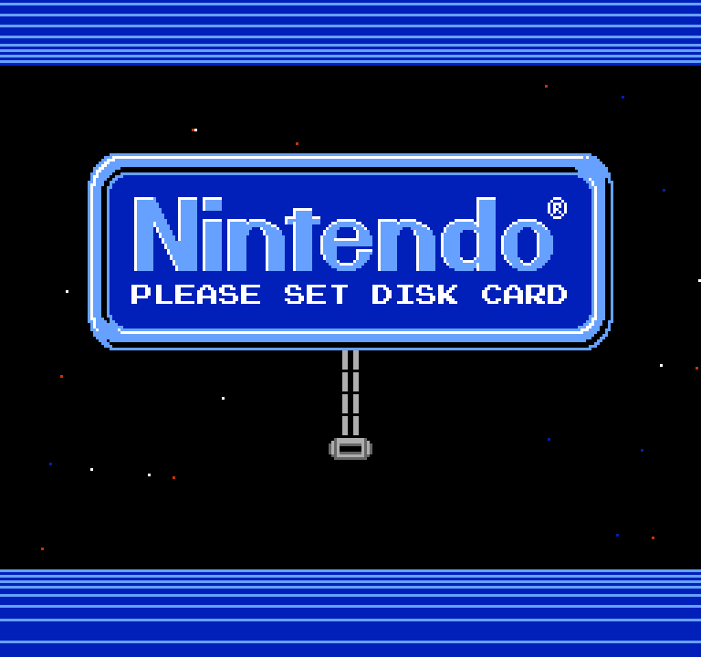
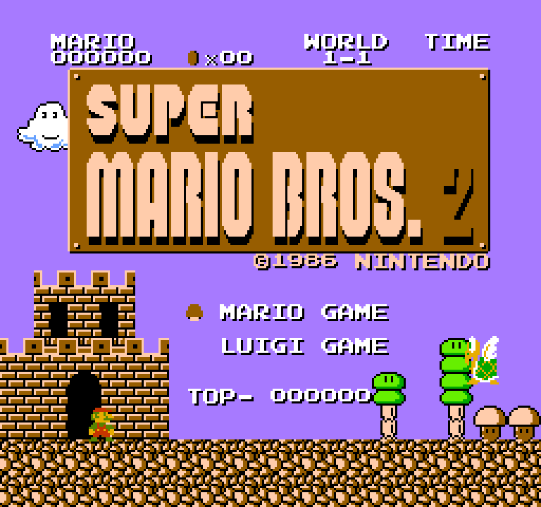
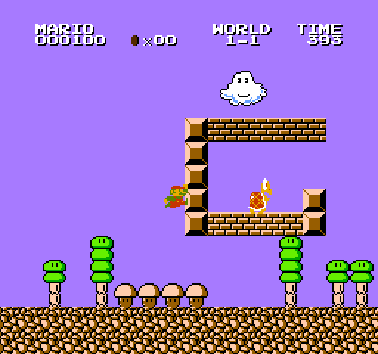
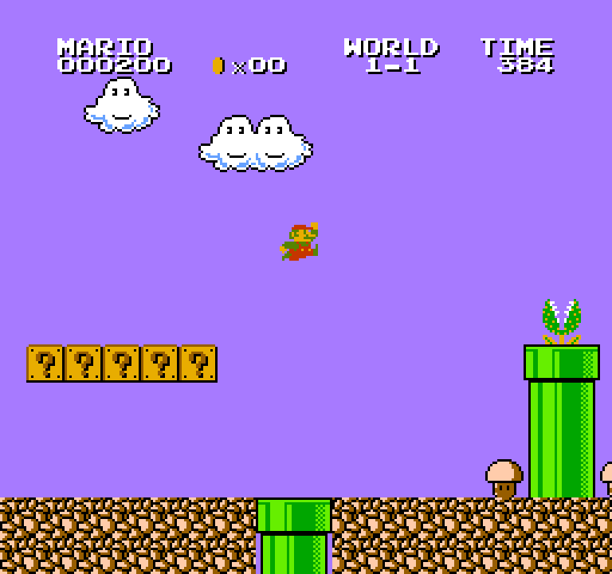

# Super Mario Bros. 2 (Japan) — FDS Static Recompilation

A native PC build of *Super Mario Bros. 2* for the Famicom Disk System, produced
by statically recompiling the game's 6502 code to C with
[nesrecomp](https://github.com/mstan/nesrecomp)'s cycle-accurate backend.

The real FDS BIOS runs (LLE): you see the Nintendo boot screen and the disk load
exactly as on hardware. Every program file on the disk is compiled ahead of time
at its load address. Anything the game builds in RAM at run time falls back to an
interpreter built from the same code templates.

This is the **first public release of a Famicom Disk System title built with
nesrecomp**: the first FDS game on its cycle-accurate backend, running the real
BIOS and recompiling code loaded from disk.

**No game data is included.** You supply your own disk image and FDS BIOS.

| | |
|---|---|
|  |  |
|  |  |

## Requirements

| File | Identity |
|---|---|
| Disk image | `Super Mario Bros. 2 (Japan) (Debug Value 0).fds` (No-Intro), SHA-1 `3b8c8998b4887d6dd676965943d69a320738ab9c`, SHA-256 `3200fa7325ff110e03518689245116707952aa8222bc283f94c4e774f4fcadbc` |
| FDS BIOS | Any file name; 8192 bytes, CRC32 `5E607DCF` (the RAM Adapter BIOS, often called `disksys.rom`) |

## Playing (release zip)

1. Unzip anywhere and run `SuperMarioBros2JapanFDSRecomp.exe`.
2. In the launcher, select your disk image.
3. Open **Settings → System → Select BIOS...** and pick your FDS BIOS. It is
   checked by size and CRC and remembered in `config.ini`.
4. Press **Play**.

| Action | Keyboard | Controller |
|---|---|---|
| D-pad | Arrows | D-pad |
| A / B | Z / X | A / X |
| Start / Select | Enter / Backslash | Start / Back |
| Disk | D | LB |
| Menu | Escape | RB |
| Fast-forward | Tab (hold) | RT |

All bindings can be changed on the launcher's Controls page.

**Disk button.** Press it once to see the drive state. Press it again while the
notice is showing to swap to the next side. SMB2J has one side, so it just
re-inserts. Disk saves go to `saves/` beside the executable; the image itself is
never written.

## Building from source

Windows, Visual Studio 2022 and CMake 3.20+. Put your disk image in the repository
root and your BIOS at `bios/disksys.rom`. The BIOS is recompiled into the program
and checked against `bios/disksys.toml`. Neither file is tracked.

```sh
setup.bat            # or ./setup.sh: checks out nesrecomp + recomp-ui
cmake -S . -B build -G "Visual Studio 17 2022" -A x64
cmake --build build --config Release
powershell -File tools/make_release.ps1   # optional: release zip in release/
```

`-DNESRECOMP_HEADLESS=ON` builds without a window, for scripted runs. `routes/`
holds scripted play routes (`python routes/run_routes.py <exe>`). The same routes
can also produce a local RAM capture file (`--capture-log cyc_captures.txt`, then
configure with `-DNESRECOMP_CYCLE_CAPTURES=cyc_captures.txt`), which compiles the
code the game copies into RAM as well. That file contains game code, so it is
gitignored and must never be committed.

## License

PolyForm Noncommercial 1.0.0; see [LICENSE](LICENSE). *Super Mario Bros. 2* and the
Famicom Disk System are trademarks of Nintendo. This project is not affiliated with
or endorsed by Nintendo.
